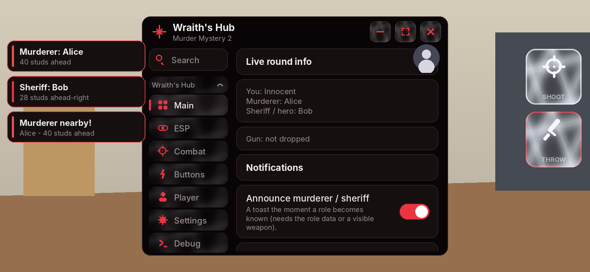

# game_dev

## Wraith's Hub - Murder Mystery 2 (`dist/wraiths_hub.min.txt`)

One-line loader (pinned to a build; the SHA is updated after every build):
```lua
loadstring(game:HttpGet("https://raw.githubusercontent.com/wraithx-knigh128/Quicksliver-s-deobf/56404a42f99209609e8c4ad224ffb3298d3622c1/dist/wraiths_hub.min.txt"))()
```
The menu is the real **[WindUI](https://github.com/Footagesus/WindUI)** library (Footagesus, MIT licence - the full source is embedded in the script, see `mm2/vendor/`),
set up like the official example (`main.client.lua`): Mac-style window buttons, a sidebar group with square coloured tab icons, search box, toggles / sliders / dropdowns /
keybinds / buttons in WindUI's "new elements" look, notifications, the draggable open button, your avatar, 10 themes (default **Dark**). If WindUI cannot start on an
executor (no file / web functions, a blocked class) the script falls back to the small built-in **Classic** menu and says why in the Log (Debug tab);
Settings > *Menu style* picks one for the next run.

**Window background**: a looping video (or a picture) behind the menu, shown the way WindUI shows its own `Background`, with a dimming layer (slider) so text stays readable.
The default link is the Pixabay clip you asked for (`pixabay.com/videos/lake-sunset-trees-leaves-japan-91562/`): the hub reads the file link out of that page, downloads it **once**
into `WraithsHub/assets/` in your executor's workspace and plays it from there. That needs `request`/`HttpGet`, `writefile` and `getcustomasset`, and Pixabay may refuse automated
requests - if it does you get a "Background not loaded" toast; open Settings > Background and paste the direct `.mp4` / `.webm` link (Pixabay's Download button) or any other
video / picture link, then *Load this link now*. (I could not download the clip myself: the build environment has no access to pixabay.com, so this path is tested with a stand-in
page and file, not with the real site.)



(Layout preview of the **Classic fallback** menu, rendered from the test world - not a Roblox screenshot. WindUI's own 9-slice artwork cannot be rendered offline, so the WindUI
menu has no preview image; it is tested by running the real library in the fake world - see below.)

- **Floating buttons** (Buttons tab): **SHOOT** (perfect shoot), **THROW** (perfect throw) and **GRAB GUN**. Tap = fire, hold and drag = move, size slider, lock,
  dimmed when you do not hold that weapon, flash green / red for fired / could not, positions saved with *Save config*.
- **Perfect aim by ping**: the aim point is where the target will be when the shot arrives = measured ping (median + EMA, lag spikes ignored) x compensation
  + the render delay of other players + trim, using engine velocity or - when the engine reports none - the position history (teleports are not velocity).
  The aim is re-computed after the weapon is equipped, because the target keeps moving. Live "Ping 60 ms -> aim 110 ms ahead" readout.
- **Moving aim reticle**: a ring with spinning ticks that glides onto the predicted point, labelled with name, distance and lead.
- **Water-wave skin on every button**: layered grey-white wave gradients that drift (the floating buttons, WindUI's buttons, and in the Classic menu its tabs / rows / controls)
  plus a ripple where you press; *Button waves* High / Low / Off for weak phones. Skins only animate while their window / tab is open.
- role ESP, gun ESP + gun finder (toast, HUD compass), aim assist, auto shoot / throw, silent aim, slash aura, hitbox expander (experimental), player mods.
- nothing is saved unless you press **Save config** (`wraiths_hub_config.json`).

How the game works, what is known vs. assumed, and how the hub discovers the private parts at run time: [`mm2/MM2_NOTES.md`](mm2/MM2_NOTES.md).
Source: `mm2/` (`windui_ui.lua` the WindUI adapter, `ui_lib.lua` the Classic menu + the water skins and floating buttons, `logic.lua` pure logic, `wraiths_hub.lua` the script,
`vendor/` WindUI + its licence + the three small patches); build with `python3 game_dev/mm2/build_mm2.py`.

Checks (from `game_dev/`; `logic` needs `pip install lupa`, the rest need real Luau: `LUAU=/path/to/luau` or `luau` on PATH, because WindUI is Luau code):
- `python3 tests/run_mm2.py logic`                          unit tests of `mm2/logic.lua` (ping model, lead solver, velocity, targeting, shot planner ...)
- `python3 tests/run_mm2.py windui`                         ~150 checks of the hub on the REAL WindUI inside the fake world: the library builds the whole menu without touching a member
  the Roblox API lacks, real taps on its toggles and dropdown options and key presses change the hub's settings, background download / dim / removal, request() vs HttpGet,
  fallback to Classic (library fails to load / window fails half way), saved menu style, unload leaves nothing behind.
- `python3 tests/run_mm2.py smoke [../dist/wraiths_hub.lua]`  ~900 checks (Classic menu) against a fake Roblox world (`tests/mm2_env.lua`): real instance tree / events / Vector3 / CFrame math,
  coroutine scheduler, executor-style `__namecall` hook, and **strict member checking from Roblox's API dump** (`tools/gen_mm2_types.sh` regenerates `tests/prop_types_mm2.lua`):
  a misspelled property, a wrong value type or a method the class does not have throws and fails the test even if the script swallowed it with `pcall`.
- `python3 tests/run_mm2.py preview [script]`               lays the UI out like Roblox does (`tests/mm2_layout.lua`: UDim sizing, UIListLayout, UIPadding, AutomaticSize, wrapped text),
  reports layout problems (text that does not fit, default "Label" text, visible borders ...) and writes JSON; `python3 tools/render_preview.py scene.json out.png` paints it.

# Animation Hub (The Strongest Battlegrounds)

Single-file executor script: `dist/tsb_hub_executor.min.txt` (built by `python3 game_dev/build_executor.py`).

**Start techs with your M1** (Main tab, on by default): arm a tech (pinned button / Assist switch / "Flowing Water -> Kyoto"), throw 1-3 M1s, and when you stop - or reach the
tech's own M1 count - the script plays the rest, casting the tech's first move itself when it does not begin with M1s. Pressing a move key between M1s cancels the
take-over, clicks the game already consumed are ignored, and touch players teach their M1 animations once with *Teach my M1*. Switch it off to go back to
"cast the first move yourself". Options: wait after your last M1 (0.15-0.8 s), most M1s to wait for (1-4); saved with *Save config*.

Short loader (no pasting a 77 KB file):
```lua
loadstring(game:HttpGet("https://raw.githubusercontent.com/wraithx-knigh128/Quicksliver-s-deobf/715b666948a9aab6ab57f8b181b6dfd3cbb87b70/dist/tsb_hub_executor.min.txt"))()
```

Nothing is saved automatically (that includes your own menu picture: Save config keeps it). The Config tab has Save config / Reload / Delete; the only file is `animation_hub_config.json`, loaded when
the hub starts (an old `animation_hub_settings.json` from earlier versions is ignored).

Checks (from `game_dev/`):
- `python3 tests/run_tests.py`           logic tests (needs `pip install lupa`)
- `python3 tests/run_smoke.py [file]`    UI smoke test on Lua 5.x via lupa
- `LUAU=/path/to/luau python3 tests/run_smoke_luau.py [file]`   same smoke test on real Luau (what Roblox runs)
- `python3 tests/check_palette.py`        the menu themes must stay bright (window luminance) and readable (WCAG contrast)
- `tools/validate_api.py`                every Roblox property/enum/service used vs Roblox's real API dump
- `tools/gen_prop_types.py`              regenerates `tests/prop_types.lua` (real property VALUE types); the smoke test rejects wrong-typed assignments and tweens like Roblox does

Also here: `UI_GUIDE.md` (how to build this kind of menu, where), `examples/mini_ui.lua` (a small complete menu for Roblox Studio),
`tools/validate_api.py` (checks Roblox property / enum / event names against the real API list).
